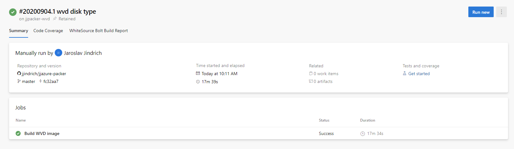
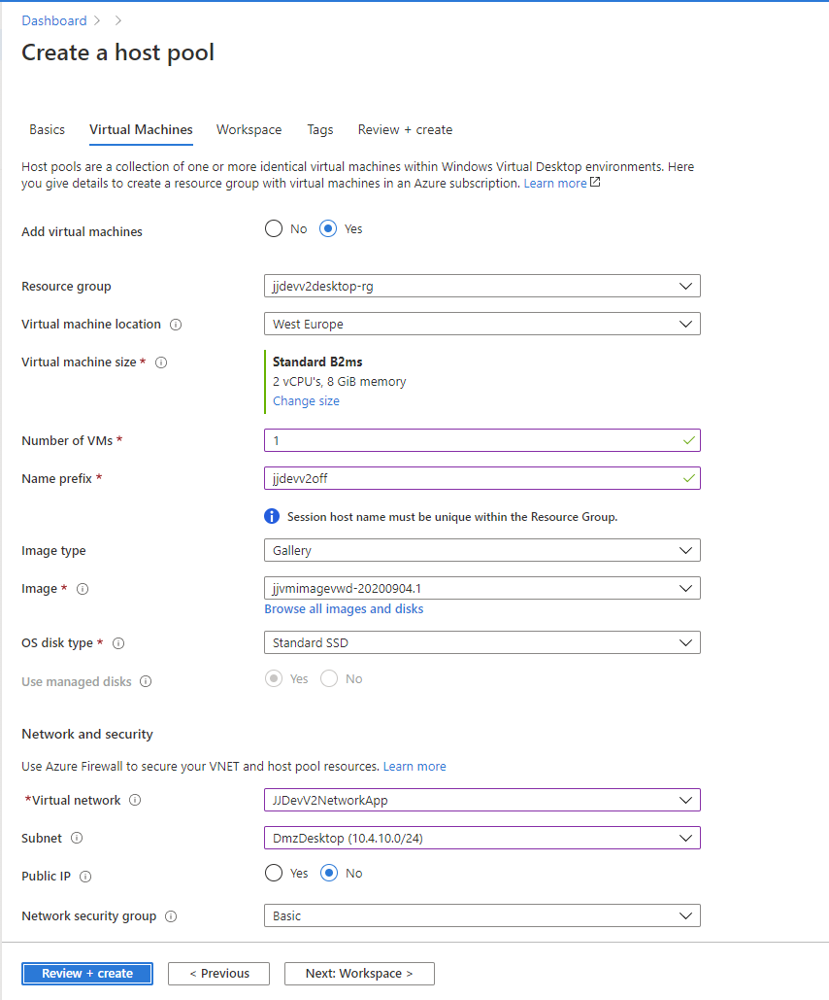
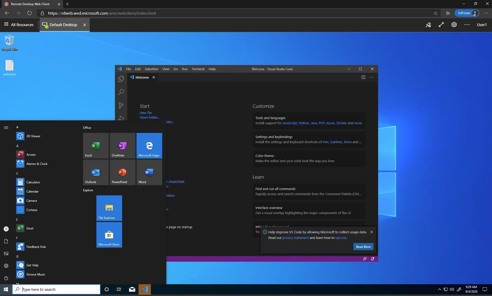

# jjazure-packer

This repository describes how to bake custom image with your application and run this application. Application is simple webpage, source code is typically prepared in CI build process. For image baking using Packer Azure DevOps task. For deployment using Azure Resource Manager.

Another option is to use Azure Computer Gallery to bake image.

## Using Packer

Repository structure

- folder [packer](packer) - deployment script for Packer
- folder [app](packer/app) - prepared application code for Packer (typically builded in CI part)
- folder [template](template-test-image) - ARM script for deployment to test image
- pipeline definition in [azure-pipelines-packer.yaml](azure-pipelines-packer.yaml)

Application deployed into two environments

- DEV - deleted and created virtual machine (VM) based on image with private ip
- TEST - created and updated virtual machine scaleset (VMSS) based on image with public IP (check NSG on your network)

Following articles can help you

- [How to use Packer to create Linux virtual machine images](https://docs.microsoft.com/en-us/azure/virtual-machines/linux/build-image-with-packer)
- [Implement continuous deployment of your app to an Azure Virtual Machine Scale Set](https://docs.microsoft.com/en-us/azure/devops/pipelines/apps/cd/azure/deploy-azure-scaleset?view=azure-devops)
- [Azure virtual machine scale set from a Packer custom image by using Terraform](https://docs.microsoft.com/en-us/azure/developer/terraform/create-vm-scaleset-network-disks-using-packer-hcl)

### Prepare resources for DevOps

Create new Azure Storage Account for temporary data

- resource group jjpacker-rg
- storage account jjpackerstorage

```bash
az group create -n jjpacker-rg -l westeurope
az storage account create -n jjpackerstorage -g jjpacker-rg -l westeurope --sku Standard_LRS --kind StorageV2
```

Images will be stored in this resource group.

### Check and test ARM deployment (optional)

There are two templates - deploy VM and VMSS.

You can run this commands to deploy VM (fill-in password in template)

```powershell
$rg="jjdevv2vmapplx-rg"
az group create -n $rg -l westeurope
az deployment group create -g $rg --template-file deploy.json --parameters deploy.parameters.json
```

You can run this commands to deploy VMSS (fill-in password in template)

```powershell
$rg="jjdevv2vmssapplx-rg"
az group create -n $rg -l westeurope
az deployment group create -g $rg --template-file deploy-vmss.json --parameters deploy-vmss.parameters.json
```

### DevOps pipeline

Check YAML pipeline definition using tasks

- [Build Machine Image (Packer) task](https://docs.microsoft.com/en-us/azure/devops/pipelines/tasks/deploy/packer-build?view=azure-devops) in packer folder
- [Azure Resource Group Deployment task](https://docs.microsoft.com/en-us/azure/devops/pipelines/tasks/deploy/azure-resource-group-deployment?view=azure-devops) in template folder

Check pipeline definition [azure-pipelines-packer.yaml](azure-pipelines-packer.yaml)

Create new Azure DevOps pipeline

- use pipeline definition
- create new Variable group in Library section with name jjpacker-DEV and add variable adminPassword
- create new Variable group in Library section with name jjpacker-TEST and add variable adminPassword

Run pipeline. You can test new deployment - change application source [index.html](packer/app/index.html) and commit changes. It will be deployed automatically.


## Using Packer for Windows Virtual Desktop

### Image for Windows Virtual Desktop

This section help you how to build custom image for Windows Virtual Desktop (ARM release) automatically (with Packer).
We will create new image of Windows 10 Enterprise multi-session with Microsoft 365 Apps.

Image customization

- install VS Code
- place file on Desktop with e.g. user's instructions

Following articles can help you for some advanced scenarios

- Default Packer templates - https://github.com/microsoft/azure-pipelines-tasks/tree/master/Tasks/PackerBuildV1/DefaultTemplates
- Image for Windows Virtual Desktop - https://github.com/TomHickling/WVD-CI-CD

Repository structure

- folder [packer WVD](packer-wvd) - deployment script for Packer Windows Virtual Desktop
- pipeline definition in [azure-pipelines-packer-wvd.yaml](azure-pipelines-wvd.yaml)

Next create new pipeline based on this pipeline definition in [Azure DevOps](https://dev.azure.com).



After pipeline finished, start new Windows Virtual Desktop hostpool

- select prepared image.
- register desktop app group
- assign application group to some users



Go to Windows Virtual Desktop application or [web](https://rdweb.wvd.microsoft.com/arm/webclient) and check workstation.



## Using Azure Computer Gallery for Azure Virtual Desktop (AVD)

This section describes how create image using Azure Compute Gallery with Azure Image Builder task to build image and publish images.

Related documentation Azure Image Builder

- https://learn.microsoft.com/en-us/azure/cloud-adoption-framework/scenarios/wvd/eslz-platform-automation-and-devops#create-azure-virtual-desktop-images
- https://learn.microsoft.com/en-us/azure/virtual-machines/image-builder-overview
- https://learn.microsoft.com/en-us/azure/virtual-machines/linux/image-builder-devops-task
- https://github.com/marketplace/actions/build-azure-virtual-machine-image
- https://docs.microsoft.com/en-us/azure/virtual-machines/windows/image-builder-virtual-desktop
- https://github.com/Azure/azvmimagebuilder/tree/main/solutions/14_Building_Images_WVD

How to integrate with Azure DevOps

- https://github.com/Azure/azvmimagebuilder/tree/main/solutions/1_Azure_DevOps

Run custom script

- https://learn.microsoft.com/en-us/azure/virtual-machines/windows/image-builder-virtual-desktop
- https://learn.microsoft.com/en-us/azure/virtual-machines/linux/image-builder-json?tabs=json%2Cazure-powershell
- https://learn.microsoft.com/en-us/azure/virtual-machines/linux/image-builder-user-assigned-identity


Repository structure

- folder [imagebuilder](imagebuilder) - Bicep definition for resources

### Prepare Managed Identity for deployment

User Identity must be provided to access other Azure resources, check [docs](https://learn.microsoft.com/en-us/azure/virtual-machines/linux/image-builder-permissions-cli)

For now we will use Contributor role on subcription level

```powershell
$rg="jjinfra-rg"
$identityName="jjazidentity-imagebuilder"
az identity create --resource-group $rg --name $identityName
$subscriptionID=$(az account show --query id --output tsv)
$identityID=$(az identity show -g $rg -n $identityName --query clientId -o tsv)
az role assignment create --assignee $identityID --role Contributor --scope /subscriptions/$subscriptionID
```

### Deploy resources

List of possible images for e.g. AVD

```powershell
az vm image list --publisher MicrosoftWindowsDesktop -l WestEurope --architecture x64 -o table --all
```

Run this for deployment

```powershell
deploy.ps1
```

!!! VM Image template cannot be changed, you cannot change template definition. !!!

Now you can create VM from your image - just click in portal.
