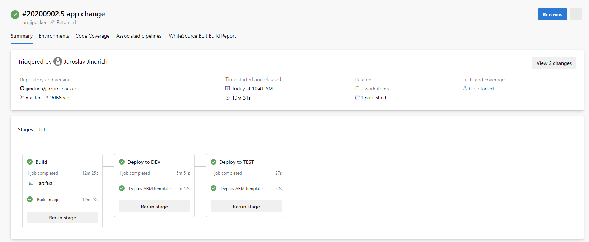

# jjazure-packer

This repository describes how to bake custom image with your application and run this application. Application is simple webpage, source code is typically prepared in CI build process.
For image baking using Packer Azure DevOps task. For deployment using Azure Resource Manager.

**Another option is use Azure Image Builder with Azure Shared Image Gallery** to build image and publish images, check this [jjazure-packer-imagebuilder](template-builder).

## Using Packer

Repository structure

- folder [packer](packer) - deployment script for Packer
- folder [app](packer/app) - prepared application code for Packer (typically builded in CI part)
- folder [template](template-test-image) - ARM script for deployment to test image
- pipeline definition in [azure-pipelines-packer.yaml](azure-pipelines-packer.yaml)

Application deployed into two environments

- DEV - deleted and created virtual machine (VM) based on image with private ip
- TEST - created and updated virtual machine scaleset (VMSS) based on image with public IP (check NSG on your network)

Following articles can help you

- [How to use Packer to create Linux virtual machine images](https://docs.microsoft.com/en-us/azure/virtual-machines/linux/build-image-with-packer)
- [Implement continuous deployment of your app to an Azure Virtual Machine Scale Set](https://docs.microsoft.com/en-us/azure/devops/pipelines/apps/cd/azure/deploy-azure-scaleset?view=azure-devops)
- [Azure virtual machine scale set from a Packer custom image by using Terraform](https://docs.microsoft.com/en-us/azure/developer/terraform/create-vm-scaleset-network-disks-using-packer-hcl)

### Prepare resources for DevOps

Create new Azure Storage Account for temporary data

- resource group jjpacker-rg
- storage account jjpackerstorage

```bash
az group create -n jjpacker-rg -l westeurope
az storage account create -n jjpackerstorage -g jjpacker-rg -l westeurope --sku Standard_LRS --kind StorageV2
```

Images will be stored in this resource group.

### Check and test ARM deployment (optional)

There are two templates - deploy VM and VMSS.

You can run this commands to deploy VM (fill-in password in template)

```powershell
$rg="jjdevv2vmapplx-rg"
az group create -n $rg -l westeurope
az deployment group create -g $rg --template-file deploy.json --parameters deploy.parameters.json
```

You can run this commands to deploy VMSS (fill-in password in template)

```powershell
$rg="jjdevv2vmssapplx-rg"
az group create -n $rg -l westeurope
az deployment group create -g $rg --template-file deploy-vmss.json --parameters deploy-vmss.parameters.json
```

### DevOps pipeline

Check YAML pipeline definition using tasks

- [Build Machine Image (Packer) task](https://docs.microsoft.com/en-us/azure/devops/pipelines/tasks/deploy/packer-build?view=azure-devops) in packer folder
- [Azure Resource Group Deployment task](https://docs.microsoft.com/en-us/azure/devops/pipelines/tasks/deploy/azure-resource-group-deployment?view=azure-devops) in template folder

Check pipeline definition [azure-pipelines-packer.yaml](azure-pipelines-packer.yaml)

Create new Azure DevOps pipeline

- use pipeline definition
- create new Variable group in Library section with name jjpacker-DEV and add variable adminPassword
- create new Variable group in Library section with name jjpacker-TEST and add variable adminPassword

Run pipeline. You can test new deployment - change application source [index.html](packer/app/index.html) and commit changes. It will be deployed automatically.


## Using Packer for Windows Virtual Desktop

### Image for Windows Virtual Desktop

This section help you how to build custom image for Windows Virtual Desktop (ARM release) automatically (with Packer).
We will create new image of Windows 10 Enterprise multi-session with Microsoft 365 Apps.

Image customization

- install VS Code
- place file on Desktop with e.g. user's instructions

Following articles can help you for some advanced scenarios

- Default Packer templates - https://github.com/microsoft/azure-pipelines-tasks/tree/master/Tasks/PackerBuildV1/DefaultTemplates
- Image for Windows Virtual Desktop - https://github.com/TomHickling/WVD-CI-CD

Repository structure

- folder [packer WVD](packer-wvd) - deployment script for Packer Windows Virtual Desktop
- pipeline definition in [azure-pipelines-packer-wvd.yaml](azure-pipelines-wvd.yaml)

Next create new pipeline based on this pipeline definition in [Azure DevOps](https://dev.azure.com).


After pipeline finished, start new Windows Virtual Desktop hostpool

- select prepared image.
- register desktop app group
- assign application group to some users


Go to Windows Virtual Desktop application or [web](https://rdweb.wvd.microsoft.com/arm/webclient) and check workstation.


## Using Image Builder for Azure Virtual Desktop (AVD)
This section describes how create image using Azure Image Builder with Azure Shared Image Gallery to build image and publish images.

TODO: rewrite to bicep
TODO: add Azure DevOps

Related documentation Azure Image Builder

- https://docs.microsoft.com/en-us/azure/virtual-machines/linux/image-builder-json
- https://docs.microsoft.com/en-us/azure/virtual-machines/windows/image-builder-virtual-desktop
- https://github.com/Azure/azvmimagebuilder/tree/main/solutions/14_Building_Images_WVD

How to integrate with Azure DevOps

- https://github.com/Azure/azvmimagebuilder/tree/main/solutions/1_Azure_DevOps

Repository structure

- folder [imagebuilder](imagebuilder) - template for Azure image builder resource

### Prepare for deployment

User Identity must be provided to access other Azure resources, check [docs](https://docs.microsoft.com/en-us/azure/virtual-machines/linux/image-builder-json#identity)

```powershell
'Az.ImageBuilder', 'Az.ManagedServiceIdentity' | ForEach-Object {Install-Module -Name $_ -AllowPrerelease}
$rg = "JJDevV2-Infra"
$idenityName = "jjdevv2imagebuilder"
# create User Identity
New-AzUserAssignedIdentity -ResourceGroupName $rg -Name $idenityName
$idenityNameResourceId=$(Get-AzUserAssignedIdentity -ResourceGroupName $rg -Name $idenityName).Id
$idenityNamePrincipalId=$(Get-AzUserAssignedIdentity -ResourceGroupName $rg -Name $idenityName).PrincipalId
# assign permission Contributor
New-AzRoleAssignment -ObjectId $idenityNamePrincipalId -RoleDefinitionName "Contributor" -ResourceGroupName $rg
```

### Deploy ARM template

Template using existing virtual network to be able access network resources, check [docs](https://docs.microsoft.com/en-us/azure/virtual-machines/linux/image-builder-json#vnetconfig). Subnet must have PrivateLinkService Network Policy disabled.

Check you are using right image, you can check avaiblable images

```powershell
Get-AzVMImageSku -Location westeurope -PublisherName MicrosoftWindowsDesktop -Offer windows-10
```

Run deployment

```powershell
$rg = "JJDevV2-Infra"
az group create -n $rg -l westeurope
az deployment group create -g $rg --template-file deploy-image-wvd.json --parameters deploy-image-wvd.parameters.json
```